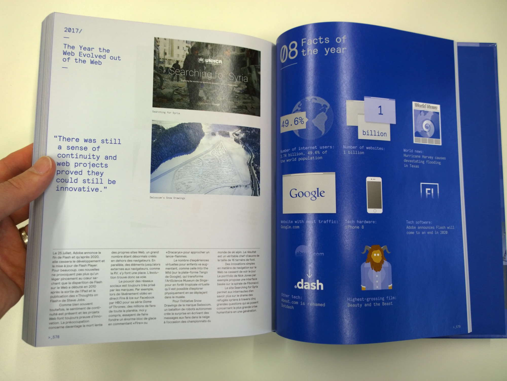

## Design d'interaction et UX

### Livres de Design UX et ergonomie, en VF

Voici quelques livres sur les thématiques Design UX et ergonomie des interfaces, en français:

- Carine Lallemand (2018). *Méthodes de design UX: 30 méthodes fondamentales*. 2e édition. Eyrolles. (004.08.03 LAL)
- Jean-François Nogier et Jules Leclerc (2016). *UX Design & ergonomie des interfaces*. 6e édition. Dunod. (004.08.03 NOG)
- Jean-François Nogier et al. (2013). *Ergonomie des interfaces : guide pratique*. 5e édition. Dunod.
- Jean-François Nogier (2005). *Ergonomie du logiciel et design web : le manuel des interfaces utilisateur*. Dunod. (004.08.03 NOG)
- Didier Mazier (2018). *UI-UX : Les bases du prototypage web et apps*. ENI. (004.08.03 MAZ)

### Livres de référence, en VO

- Bill Moggridge (2006). *Designing Interactions*. MIT Press.
- Bill Buxton (2007). *Sketching User Experiences*. Morgan Kaufmann Publishers. (Un livre étrange sur le "sketching" et le prototypage).
- Kim Goodwin (2009). *Designing for the Digital Age*. Wiley.
- Alan Cooper (2014). *About Face: The Essentials of Interaction Design*. Wiley.
- Jenifer Tidwell (2020). *Designing Interfaces: Patterns for Effective Interaction Design*. O'Reilly.

Un livre généraliste:

- *Le design interactif*, Benoît Drouillat, Dunod.

## Sur le design pour le web

- Andy Clarke (2019). *Art Direction for the Web*. Smashing Media.
- Anne-Sophie Fradier (2012). *Webgrids : structure et typographie de la page web*. Perrousseaux.

Un livre qui retrace l'histoire du web design de 1990 à 2018:

- *Web Design. The Evolution of the Digital World 1990–Today*, Rob Ford, Julius Wiedemann, Taschen.

## Sur l'accessibilité

- *Inclusive Components*, Heydon Pickering, Smashing Media.
- *Form design patterns*, Adam Silver, Smashing Media, 2018.

## Sur les systèmes

- *Design systems : A practical guide to creating design languages for digital products*, Alla Kholmatova, Smashing Media, 2017.

## Sur les portfolios

- *Réussir son portfolio et son site web*, Jonathan Munn, Pyramyd.

## Autres

*Digital Design Theory*, Helen Armstrong, Princeton Architectural Press. Un recueil de textes théoriques importants pour l'histoire du design numérique.