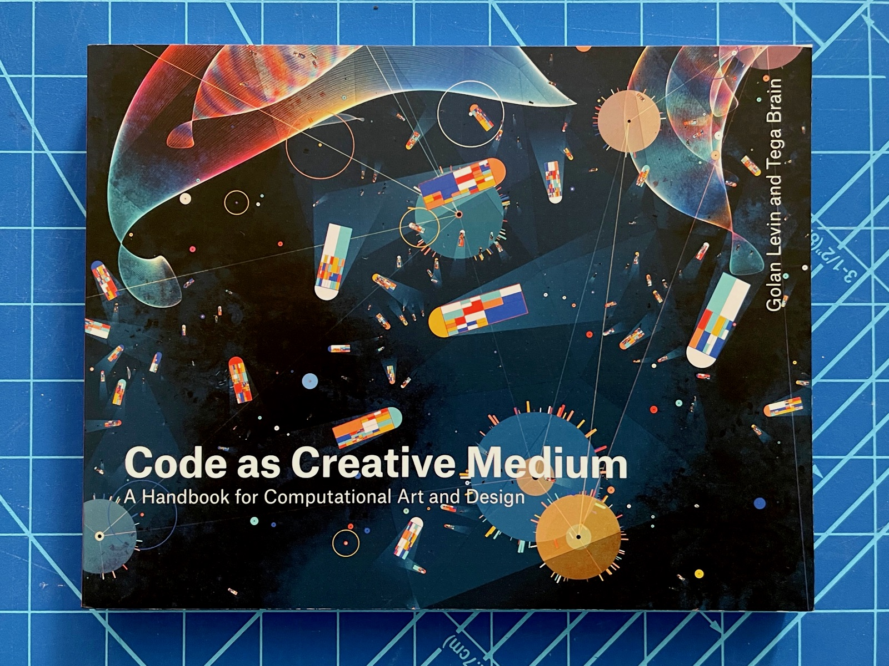
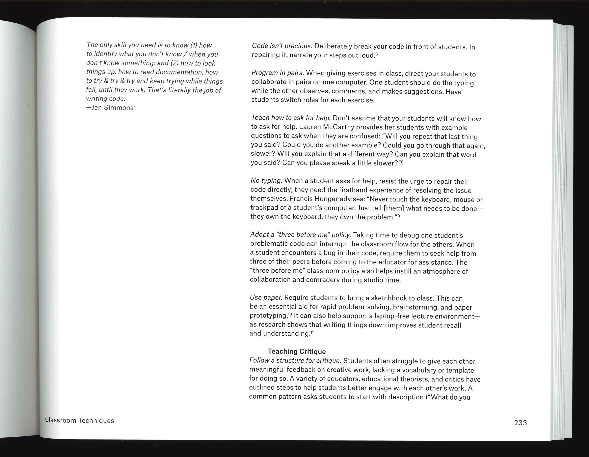

## Sur l'enseignement de la programmation

- Golan Levin and Tega Brain (2021). *Code as Creative Medium*. MIT Press.

Ce livre s'adresse explicitement aux enseignants. En plus de fournir des dizaines d'idées d'exercices, il comporte une section *Advice for New Educators*, ainsi qu'un chapitre *"Classroom techniques"*.

Un scan partiel est [disponible dans OneDrive](https://eduvaud-my.sharepoint.com/:f:/g/personal/pr51kln_eduvaud_ch/EubEwjMmQMdPinIa0tFLcHQBup7cZEehI5sV-RhlhyvLGA?e=zjU8K3).

## Livres de Raphaël Goetter

- *CSS 3 Flexbox*, Eyrolles
- *CSS 3 Grid Layout*, Eyrolles

Version PDF [disponible dans OneDrive](https://eduvaud-my.sharepoint.com/:f:/g/personal/pr51kln_eduvaud_ch/EpHYaLk37T5Es3Ox7FJD5nQBwZ_cwfeZZdujellEoxsMzQ?e=TeQnZC).

## Sur le Javascript

- *Tout JavaScript*, Olivier Hondermarck, Dunod.
- *Javascript pour les web designers*, Mat Marquis, collection A Book Apart

## Design génératif et Processing

- Bohnacker, Hartmut et al., *Generative Design : Visualize, Program, and Create with JavaScript in p5.js*, New York : Princeton Architectural Press - nouvelle édition de 2018, en anglais.

## La collection A Book Apart

Nous avons en rayon tous les titres (ou presque) de cette collection:

### Orienté code

- Jeremy Keith (2012), *HTML5 pour les web designers*.
- Dan Cederholm (2012), *CSS3 pour les web designers*.
- Mat Marquis (2017), *Javascript pour les web designers*.
- David Demaree (2018), *Git par la pratique*.

### Orientés design et UX

- Ethan Marcotte (2011), *Responsive web design*.
- Aarron Walter (2011), *Design émotionnel*.
- Luke Wroblewski (2012), *Mobile first*
- Jason Santa Maria (2015), *Typographie web*.
- Josh Clark (2016), *Design tactile*.
- Ethan Marcotte (2016), *Responsive design patterns*.

### Orientés stratégie, recherche

- Erin Kissane (2012), *Stratégie de contenu web*.
- Karen McGrane (2013), *Stratégie de contenu mobile*.
- Erika Hall (2015), *La phase de recherche en web design*.

### Orienté marketing et gestion

- Mike Monteiro (2012), *Métier web designer*.
- Mike Monteiro (2015), *Web designer cherche client idéal*.

Un scan de *Métier web designer* est [disponible dans OneDrive](https://eduvaud-my.sharepoint.com/:f:/g/personal/pr51kln_eduvaud_ch/El4cT_nRyPJDrW8UgJypdnMBswmIxmwIBTm0MlnOVW_SHA?e=wPKjDQ).
