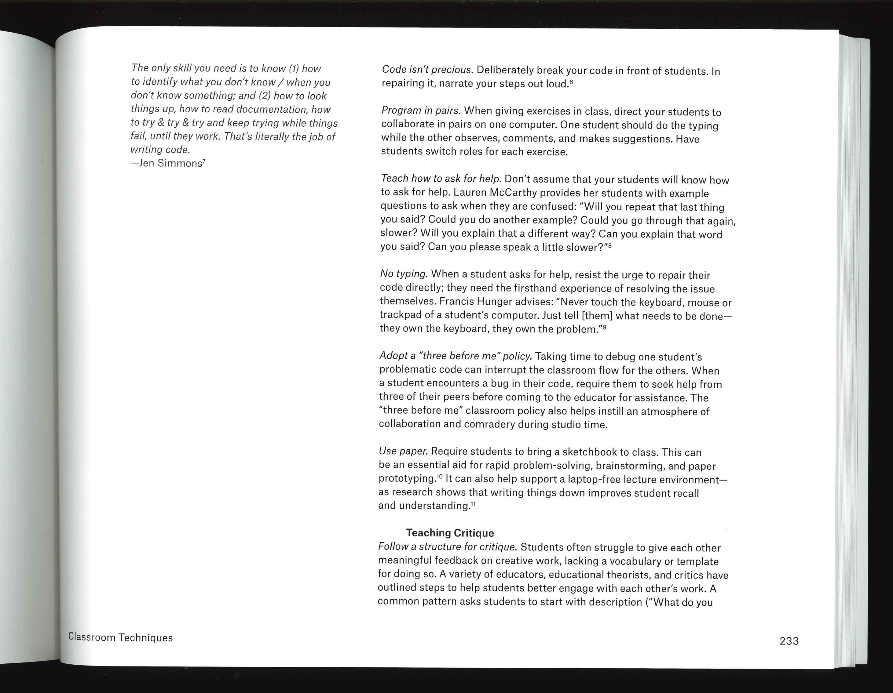
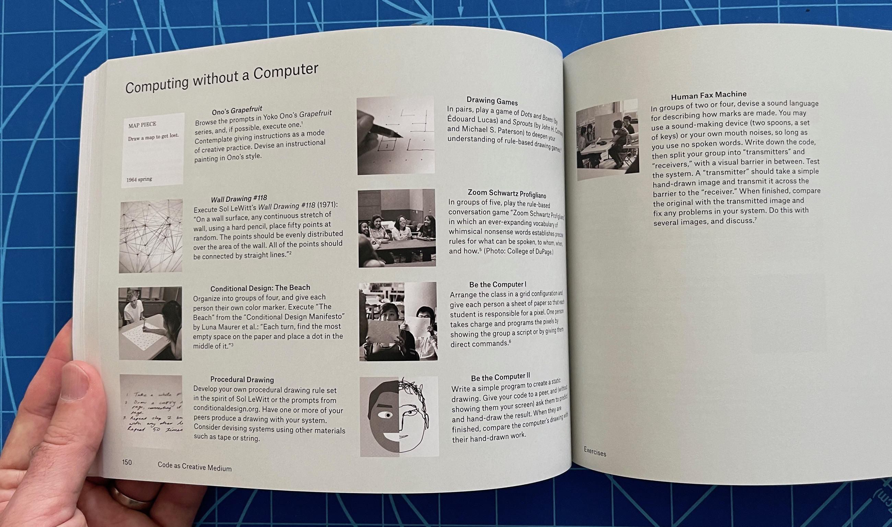
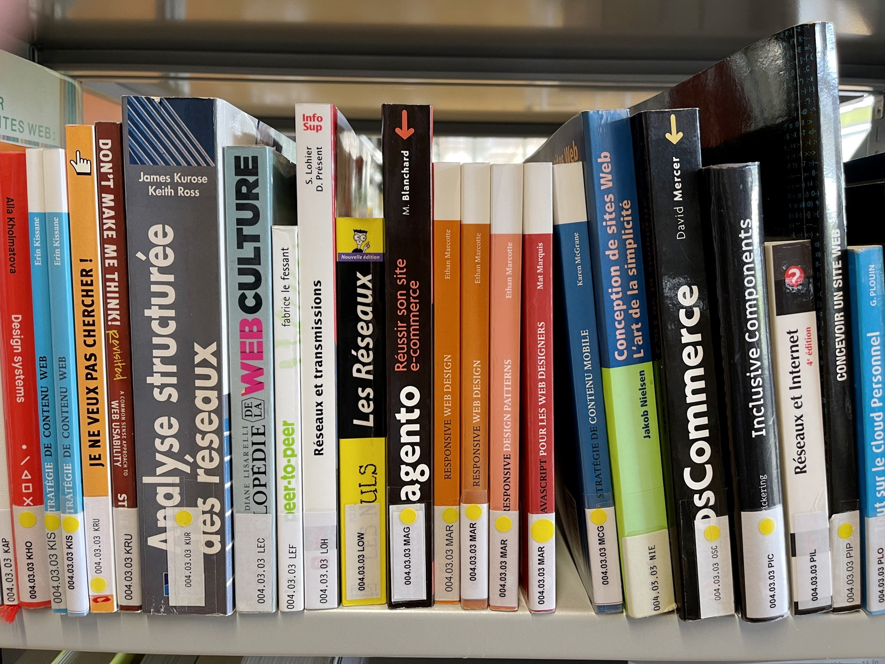

## Sur l'enseignement de la programmation

- Golan Levin and Tega Brain (2021). *Code as Creative Medium*. MIT Press. (cote: 765 LEV)

Ce livre s'adresse explicitement aux enseignants. En plus de fournir des dizaines d'idées d'exercices, il comporte une section *Advice for New Educators*, ainsi qu'un chapitre *"Classroom techniques"*.

Un scan partiel est [disponible dans OneDrive](https://eduvaud-my.sharepoint.com/:f:/g/personal/pr51kln_eduvaud_ch/EubEwjMmQMdPinIa0tFLcHQBup7cZEehI5sV-RhlhyvLGA?e=zjU8K3).

## Référentiel A11Y et qualité

- Élie Sloïm & Laurent Denis (2016). *Qualité Web : La référence pour les professionnels du Web*. Paris : Eyrolles 2016 [2ème édition]

Ce "référentiel qualité" pour le web propose 226 "bonnes pratiques" concernant tous les aspects d'un site web (code, contenus, formulaires, navigation...).

Un scan partiel est [disponible dans OneDrive](https://eduvaud-my.sharepoint.com/:f:/g/personal/pr51kln_eduvaud_ch/ElKEFJUFEktOiXcdFkrWvCcB6PN9rUdenXizhREfoflCXw?e=bTz5Ba).

## Livres de Raphaël Goetter

- *CSS 3 Flexbox*, Eyrolles (004.03.03 GOE)
- *CSS 3 Grid Layout*, Eyrolles (004.03.03 GOE)

Version PDF [disponible dans OneDrive](https://eduvaud-my.sharepoint.com/:f:/g/personal/pr51kln_eduvaud_ch/EpHYaLk37T5Es3Ox7FJD5nQBwZ_cwfeZZdujellEoxsMzQ?e=TeQnZC).

## Sur le Javascript

- *Tout JavaScript*, Olivier Hondermarck, Dunod. (004.04.01 HON)
- *Javascript pour les web designers*, Mat Marquis, collection A Book Apart (004.03.03 MAR)

## Design génératif et Processing

- Bohnacker, Hartmut et al. (2018), *Generative Design : Visualize, Program, and Create with JavaScript in p5.js*, New York : Princeton Architectural Press - c'est la nouvelle édition de 2018, en anglais. (cote: 004.03.03 BOH)

Nous avons également l'édition de 2010, en allemand: 

- Bohnacker, Hartmut et al. (2010), *Generative Gestaltung : entwerfen, programmieren, visualisieren*, Mainz : Schmidt (cote: 765 BOH)

## La collection A Book Apart

Nous avons en rayon tous les titres (ou presque) de cette collection:

### Orienté code

- Jeremy Keith (2012), *HTML5 pour les web designers*.
- Dan Cederholm (2012), *CSS3 pour les web designers*.
- Mat Marquis (2017), *Javascript pour les web designers*.
- David Demaree (2018), *Git par la pratique*. (004.03.03 DEM)

### Orienté design et UX

- Ethan Marcotte (2011), *Responsive web design*.
- Aarron Walter (2011), *Design émotionnel*. (004.03.03 WAL)
- Luke Wroblewski (2012), *Mobile first* (004.03.03 WRO)
- Jason Santa Maria (2015), *Typographie web*. (655.26 SAN)
- Josh Clark (2016), *Design tactile*. (004.03.03 CLA)
- Ethan Marcotte (2016), *Responsive design patterns*.

### Orienté stratégie, recherche

- Erin Kissane (2012), *Stratégie de contenu web*. (004.03.03 KIS)
- Karen McGrane (2013), *Stratégie de contenu mobile*. (004.03.03 MCG)
- Erika Hall (2015), *La phase de recherche en web design*. (004.03.03 HAL)

### Orienté marketing et gestion

- Mike Monteiro (2012), *Métier web designer*. (004.03.03 MON)
- Mike Monteiro (2015), *Web designer cherche client idéal*. (004.03.03 MON)

Un scan de *Métier web designer* est [disponible dans OneDrive](https://eduvaud-my.sharepoint.com/:f:/g/personal/pr51kln_eduvaud_ch/El4cT_nRyPJDrW8UgJypdnMBswmIxmwIBTm0MlnOVW_SHA?e=wPKjDQ).
