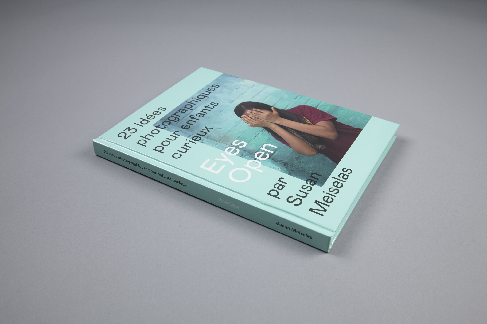
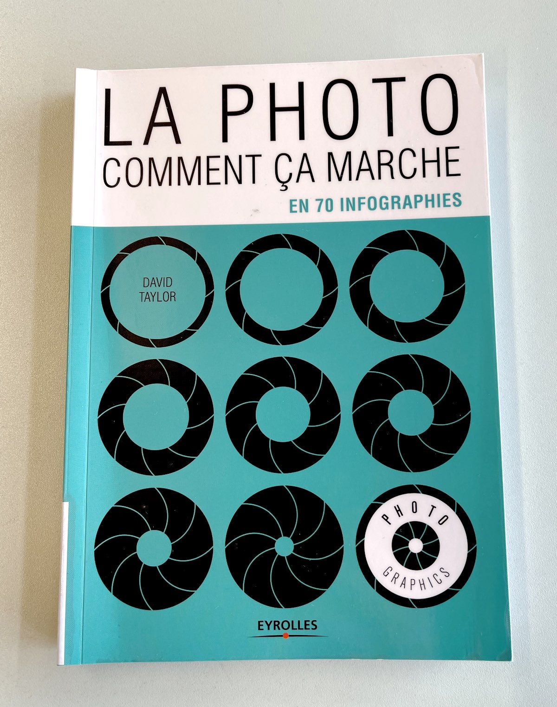
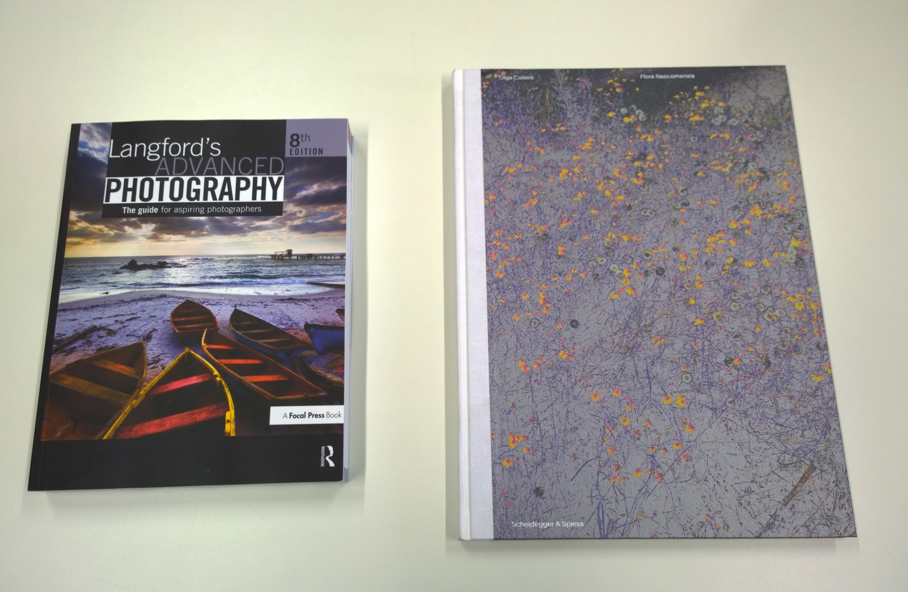

## Pour les cours vidéo

- *Le manuel de survie du vidéaste*, Ludoc, Marabout (791 LUD)
- *Cours de vidéo (4e édition)*, Gérard Galès, René Bouillot et Gérard Laurent, Dunod (Cote: 791 BOU)
- *La grammaire du cinéma : de l'écriture au montage : les techniques du langage filmé*, Yannick Vallet, Armand Colin (791 VAL)
- *Le livre qu'il vous faut pour réussir sur Youtube*, Will Eagle, Pyramyd. (Cote: 004.03.03 LIV)
- *Cinematography, Theory & Practice (3rd edition)*, Blain Brown, Focal press. (Cote: 791 BRO)
- *The Filmmaker’s Guide to Digital Imaging*, Blain Brown, Focal Press. (Cote: 791 BRO)
- *Digital Cinematography: Fundamentals, Tools, Techniques, and Workflows*, par David Stump. (Cote: 791 STU).

## Pour les cours son 

- *Prise de son : stéréophonie et son multicanal*, Christian Hugonnet, Eyrolles, 2012. Cote: 681.8 HUG.
- *Le livre des techniques du son*, Collectif d'auteurs sous la direction de D. Mercier, Dunod, 2017-2019. Cote: 681.8 LIV.

Livres disponibles à la bibliothèque à la cote "681.8".

## Pour les cours photo

Quelques livres disponibles à la bibliothèque à la cote "77":

- *La photo comment ça marche*, David Taylor, Eyrolles (77 TAY)
- *Langford's advanced photography*, Michael Langford, Routledge (77 LAN)
- *The Photographer’s Playbook* (Aperture, 2014), un livre-ressource qui propose 307 briefs et idées pour l’enseignement de la photo. (77 PHO)
- *[Eyes Open – 23 idées photographiques pour enfants curieux](https://www.delpireandco.com/produit/eyes-open/)*, Susan Meiselas, delpire & co. Cote: 77 MEI.

> *Eyes Open* s’adresse aux enfants et aux adolescents qui désirent découvrir ou approfondir leur pratique de la photographie. Grâce à 23 propositions, le lecteur curieux, débutant ou aguerri, joue avec son smartphone ou son appareil photo pour aborder le monde qui l’entoure. (...) *Eyes Open* s’inscrit dans la lignée de *Learn To See* (The Polaroid Foundation, 1974), un livre publié par Susan Meiselas, alors jeune diplômée en sciences de l’éducation à Harvard, aujourd’hui épuisé.

