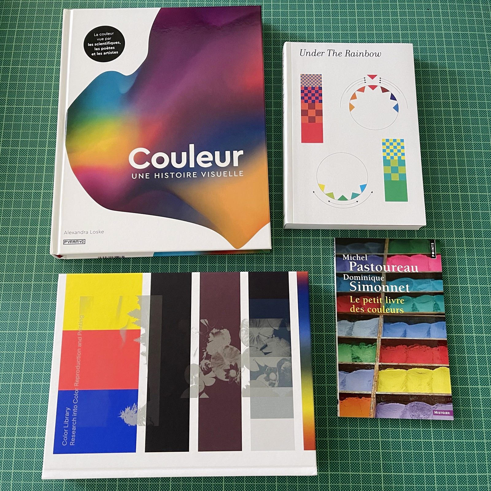
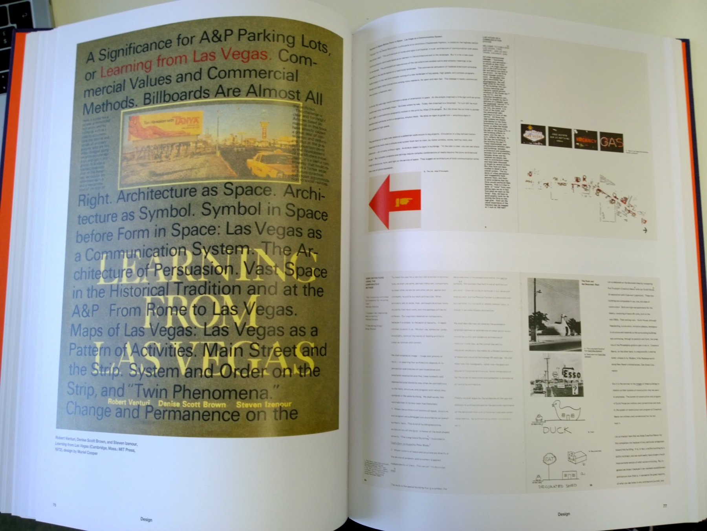
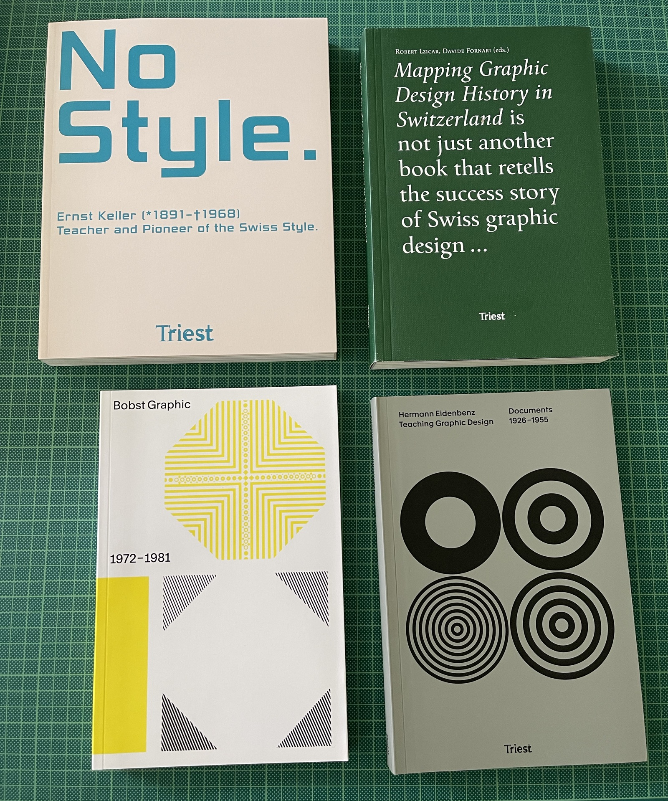
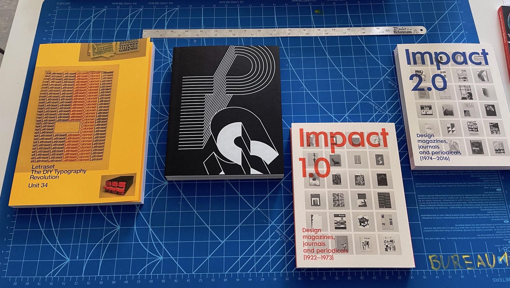
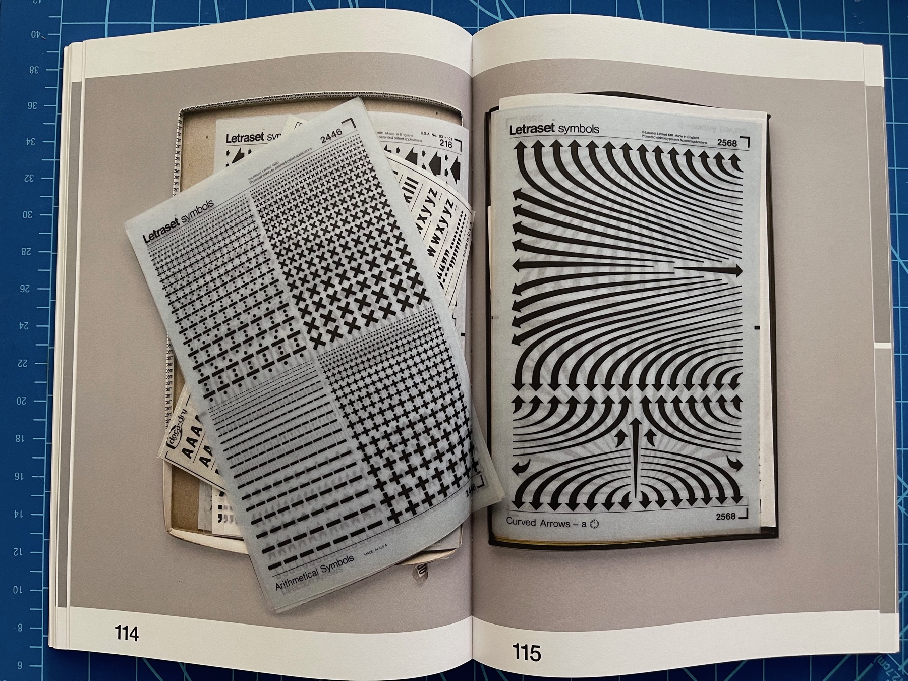
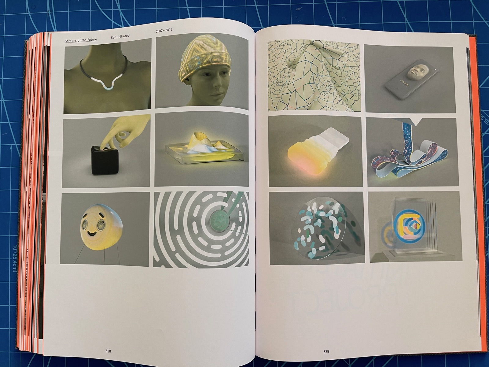
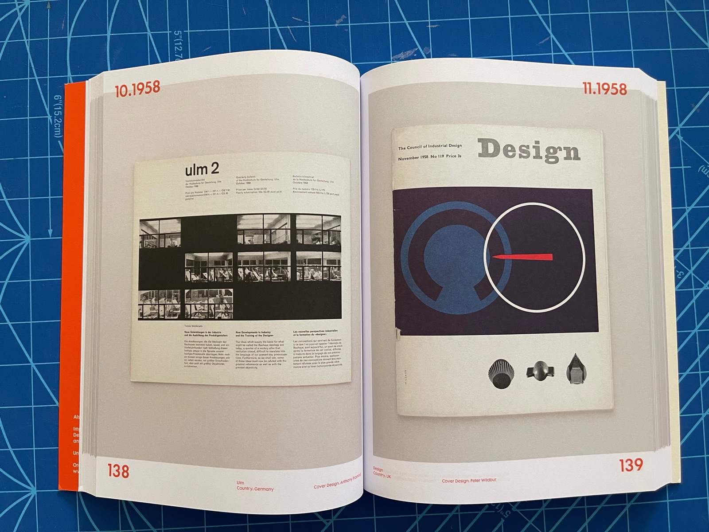
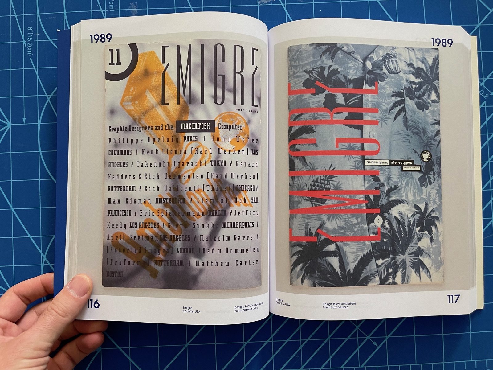

## Livres édités par Ellen Lupton

Trois petits bijoux pour l'enseignement du design:

- *Graphic Design: The New Basics* (2015), Princeton Architectural Press (765 LUP)
- *Graphic Design Thinking* (2011), Princeton Architectural Press (765 GRA)
- *Design is Storytelling* (2017), Thames & Hudson (765 LUP)

Une version PDF de *Graphic Design: The New Basics* est [disponible dans OneDrive](https://eduvaud-my.sharepoint.com/:f:/g/personal/pr51kln_eduvaud_ch/EuZCdiK9s3NBgigQHezCWswBdABl-4gms1FB_bJ6xyLaxQ?e=c0rDPY).

## Thématique: couleur

- *Couleur : une histoire visuelle*, Alexandra Loske, Pyramyd. (535.6 LOS)
- *Under the Rainbow*, Édité par: Tatiana Rihs, Maximage, ECAL. (535.6 ECA)
- *Color Library - Research into Color Reproduction and Printing*, Maximage & ECAL, JRP Ringier. (535.6 ECA)
- *Le petit livre des couleurs*, Michel Pastoureau et Dominique Simonnet, Points. (535.6 PAS)

## Histoire du design

### Muriel Cooper, monographie, MIT Press

Superbe monographie consacrée à [Muriel Cooper](https://fr.wikipedia.org/wiki/Muriel_Cooper):

*Muriel Cooper* (2017), David Reinfurt et Robert Wiesenberger, The MIT Press. (760 COO)

### Histoire du design, de l'enseignement

- Nina Paim (2016). *Taking a line for a walk : assignments in design education*. Leipzig : Spector Books (765 TAK). Voir [des extraits dans OneDrive](https://eduvaud-my.sharepoint.com/:f:/g/personal/pr51kln_eduvaud_ch/EiJL7_plIMRIhH6B3FfrHjUBahCtfLEknU9LGZEj6DeCMg?e=gtK8dR).
- *Mapping Graphic Design History in Switzerland*, Robert Lzicar, Davide Fornari, Triest Verlag. (766 MAP)
- *No Style : Ernst Keller (1891-1968) : teacher and pioneer of the Swiss style*, Peter Vetter, Katharina Leuenberger, Meike Eckstein, Triest Verlag. (760 VET)
- *Hermann Eidenbenz, Teaching Graphic Design*, Sarah Klein (ed.), Triest Verlag / ECAL. (760 EID)
- *Technology and Research in Art and Design*, Édité par: Davide Fornari, ECAL.
- *Bobst Graphic, 1972–1981* (version française), Édité par: Giliane Cachin, Triest Verlag / ECAL. (760 BOB)

### Livres de Unit Editions

Une maison d'édition anglaise, fondée en 2009: "[Unit Editions](https://www.uniteditions.com/) is an independent publishing venture, producing books for an international audience of designers, design students and followers of visual culture."

- *Manuals 2: Design & Identity Guidelines*	Adrian Shaughnessy, Tony Brook. Edition fac-similé d'identités graphiques célèbres.
- *What is Universal Everything?*, Adrian Shaughnessy, Tony Brook. Belle monographie sur [Universal Everything](https://www.universaleverything.com/projects/what-is-universal-everything), une agence de design interactif.
- *Letraset: The DIY Typography Revolution*	Adrian Shaughnessy, Tony Brook	Unit Editions
- *Paula Scher: Works (concise edition)*, Tony Brook & Adrian Shaughnessy. Monographie de la graphiste Paula Scher.
- *Impact 1.0 & 2.0*, Tony Brook & Adrian Shaughnessy. Collection de couvertures de revues de design graphique.

Quelques extraits sont [disponibles dans OneDrive](https://eduvaud-my.sharepoint.com/:f:/g/personal/pr51kln_eduvaud_ch/ErGceZmYrZpOknZawZ6PVhYBIz2GiseGhfboIrSmxlojyg?e=escUaF).

### Chartes graphiques, identités visuelles

* *IBM : graphic design guide* [Empire](https://e-m-p-i-r-e.eu/fr/produit/ibm-reedition-de-la-norme-graphique-de-paul-rand/). Réédition de la norme dessinée par Paul Rand entre 1962 et 1987. Préface de Steven Heller. Cote: 760 RAN.
- *Manuals 2: Design & Identity Guidelines*	Adrian Shaughnessy, Tony Brook. Edition fac-similé d'identités graphiques célèbres. Cote: 765 MAN.

### Divers

- *Link in Bio – Art After Social Media*, Kehrer Verlag.

