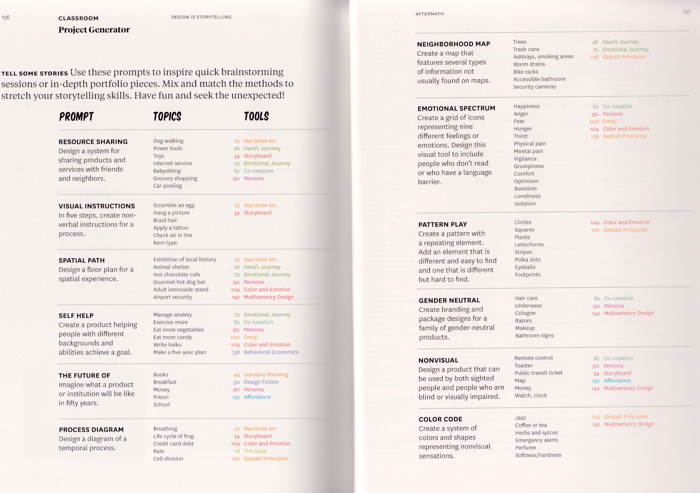
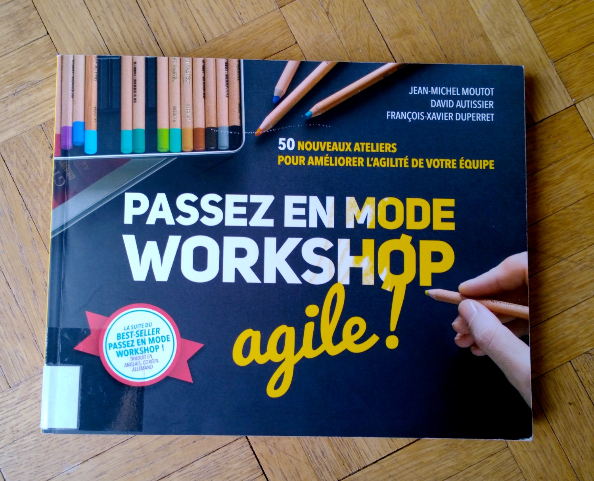

Livres autour de la créativité.

## Thématique: créativité

- Dorte Nielsen, Sarah Thurber (2017). *Les secrets de la pensée créative*. Pyramyd. (159.9 NIE).
- Jake Knapp (2019). *Sprint : Résoudre les problèmes et trouver de nouvelles idées en cinq jours*. Eyrolles. (658 KNA)
- Guillaume Lamarre (2016). *La Voie du créatif*. Pyramyd. (159.9 LAM)
- Guillaume Lamarre (2018). *L'art du storytelling*. Pyramyd. (658.8 LAM)
- Jean-Michel Moutot, David Autissier, François-Xavier Duperret (2018). *Passez en mode workshop agile ! : 50 nouveaux ateliers pour améliorer l'agilité de votre équipe*. Pearson France. (658 MOU)

Le livre de Dorte Nielsen, *Les secrets de la pensée créative*, est en partie [disponible dans OneDrive](https://eduvaud-my.sharepoint.com/:f:/g/personal/pr51kln_eduvaud_ch/EsFt41cwTDtCsAPDkYC0NcIBfbS5IM544KYTKBpSpCr1eQ?e=dtLsEt).

### Livres édités par Ellen Lupton

- Ellen Lupton (2011). *Graphic Design Thinking*. Princeton Architectural Press (765 GRA)
- Ellen Lupton (2017). *Design is Storytelling*. Thames & Hudson (765 LUP)

### Livres contenant des briefs créatifs

- Jason Fulford (2014), *The Photographer’s Playbook: 307 Assignments and Ideas*. Aperture. (77 PHO). - Un livre-ressource qui propose 307 briefs et idées pour l'enseignement de la photo.
- Nina Paim (2016). *Taking a Line for a Walk : Assignments in design education*. Leipzig : Spector Books (765 TAK). Voir [des extraits dans OneDrive](https://eduvaud-my.sharepoint.com/:f:/g/personal/pr51kln_eduvaud_ch/EiJL7_plIMRIhH6B3FfrHjUBahCtfLEknU9LGZEj6DeCMg?e=gtK8dR). / Voir [Wikipédia](https://fr.wikipedia.org/wiki/Taking_a_Line_for_a_Walk) / Voir [AR-A+D](https://ar-ad.ch/taking-a-line-for-a-walk/).
- Dorte Nielsen, Sarah Thurber (2017). *Les secrets de la pensée créative*. Pyramyd. (159.9 NIE). Comporte un programme de 21 exercices créatifs.

#### Extraits de "Les secrets de la pensée créative"

### Sur les ateliers de créativité / brainstorming

- *Passez en mode workshop agile ! : 50 nouveaux ateliers pour améliorer l'agilité de votre équipe*. Jean-Michel Moutot ; David Autissier ; François-Xavier Duperret. Montreuil : Pearson France, (2018). (658 MOU)

[Disponible dans OneDrive](https://eduvaud-my.sharepoint.com/:f:/g/personal/pr51kln_eduvaud_ch/Ep-CvlVXlqlAvwHSHPxmTlcBWvgVa15UfhnUUHcbyBdJRg?e=0keNMl).

## Voir aussi

- Support de cours [Techniques de créativité](https://cours-web.ch/crea/) (ébauche)
