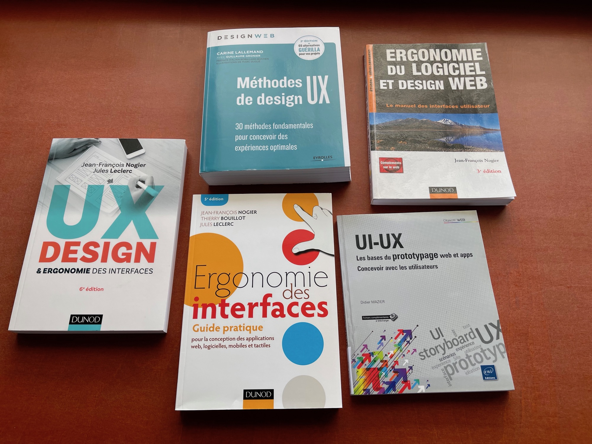
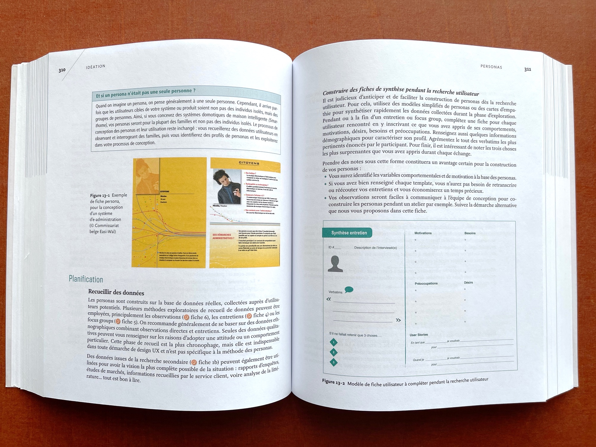
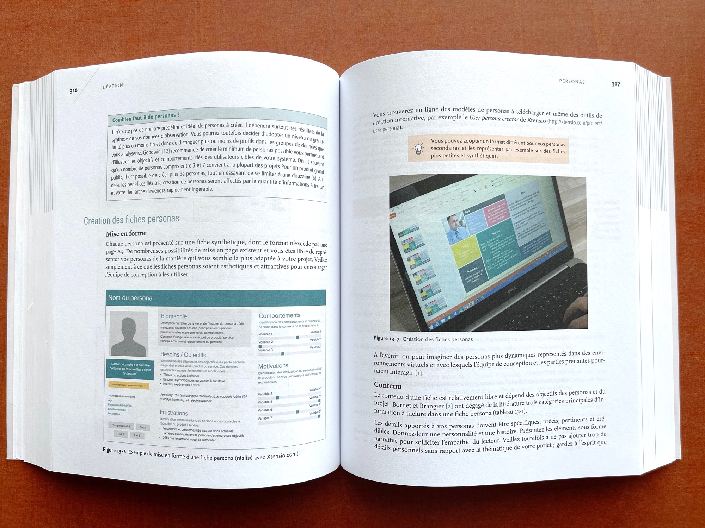

### Thématique: Recherche UX

Voici quelques livres sur les thématiques Design UX et ergonomie des interfaces, rangés à la cote 004.08.03:

- Carine Lallemand (2018). *Méthodes de design UX: 30 méthodes fondamentales*. 2e édition. Eyrolles.
- Jean-François Nogier et Jules Leclerc (2016). *UX Design & ergonomie des interfaces*. 6e édition. Dunod.
- Jean-François Nogier et al. (2013). *Ergonomie des interfaces : guide pratique*. 5e édition. Dunod.
- Jean-François Nogier (2005). *Ergonomie du logiciel et design web : le manuel des interfaces utilisateur*. Dunod.
- Didier Mazier (2018). *UI-UX : Les bases du prototypage web et apps*. ENI.

#### Méthodes de design UX

Le livre de Carine Lallemand, *Méthodes de design UX*, fournit de nombreuses ressources pour la phase "Recherche UX". Ce pavé (plus de 700 pages) détaille 30 "Méthodes de design UX", avec des fiches orientées vers la pratique. Parmi les méthodes: *Brainstorming*, *Entretien*, *Persona*, *Tri de cartes*, *Tests utilisateurs*...

Quelques extraits:

D'autres extraits sont [disponibles dans OneDrive](https://eduvaud-my.sharepoint.com/:f:/g/personal/pr51kln_eduvaud_ch/En2MdPb4H41DtsBJrsEVWB8BfSWTf6CWr3XpW0XOTXKkNQ?e=1gwp5q).

## Dans la collection A Book Apart

- Erika Hall (2015), *La phase de recherche en web design*.
