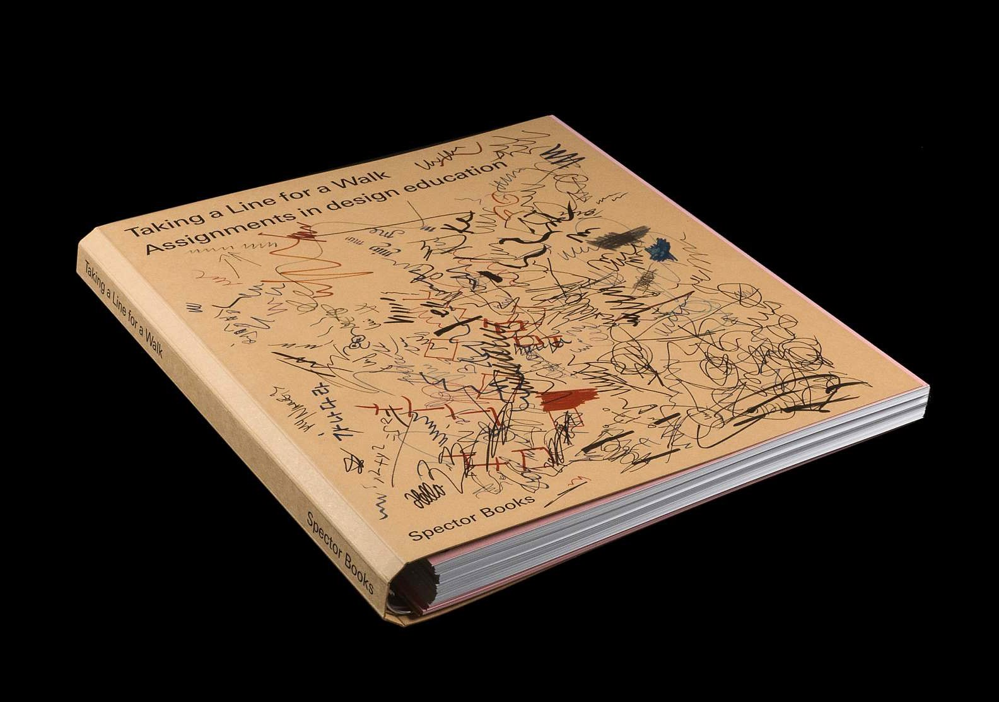
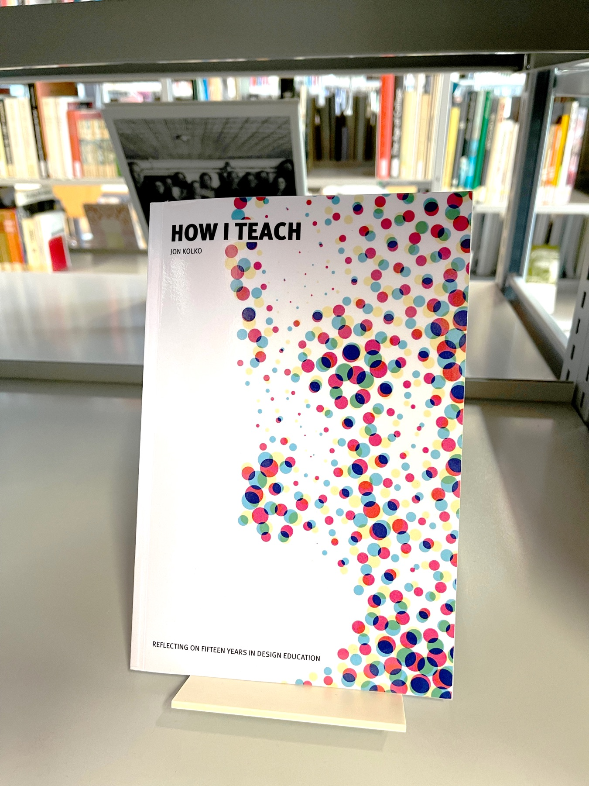
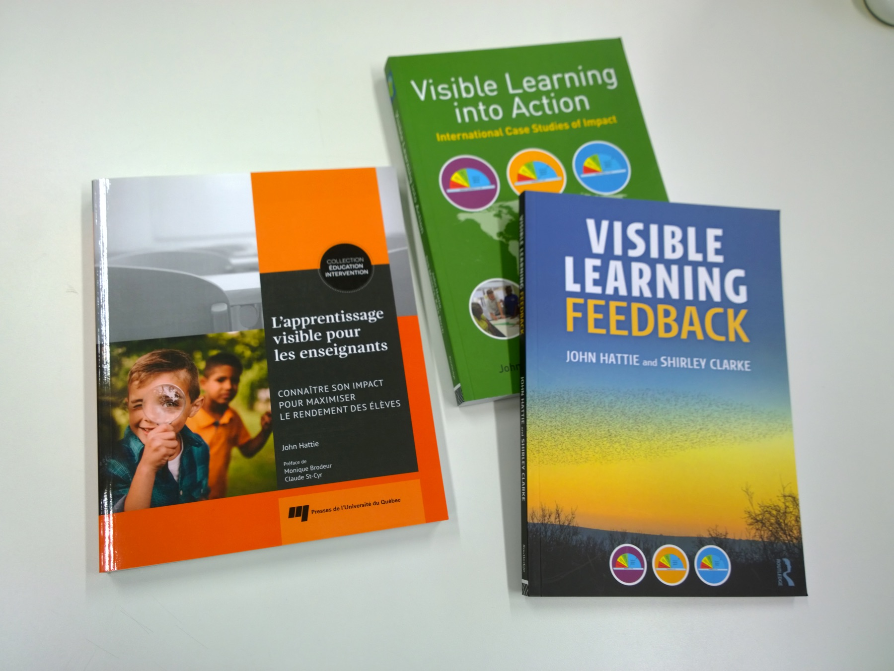

Les livres de pédagogie sont rangés à la **cote 371** de la bibliothèque Eracom-Epsic.

Voici une sélection:

## Sur l'évaluation 

Un livre utile pour créer des barèmes et des critères d'évaluation cohérents: 

- Pasquini, Raphaël (2021). *Quand la note devient constructive*. Presses de l'Université de Laval ; Paris : Hermann. (371 PAS)

Voir [un résumé du livre](https://code.eracom-pedagogique.ch/pedagogie/evaluation-constructive.html).

## Sur l'enseignement du design

- Nina Paim (2016). *Taking a Line for a Walk : Assignments in design education*. Leipzig : Spector Books (765 TAK). Voir [des extraits dans OneDrive](https://eduvaud-my.sharepoint.com/:f:/g/personal/pr51kln_eduvaud_ch/EiJL7_plIMRIhH6B3FfrHjUBahCtfLEknU9LGZEj6DeCMg?e=gtK8dR).

Un livre-objet étonnant qui collecte 224 "briefs de design" de différentes époques, depuis le Bauhaus à aujourd'hui.

- Jon Kolko (2017). *How I teach : reflecting on fifteen years in design education*. Austin: Brown Bear Publishing.

Un livre écrit par un designer interactif, qui a fondé une école, Austin Center for Design. Il y partage ses expériences de 15 ans d'enseignement du design. Quelques points forts:

- Décrit une méthode de [planification des cours](https://www.wonderfulnarrative.com/books/how-i-teach/introduction-to-course-plans)
- Insiste sur l'importance des [sessions critiques](https://www.wonderfulnarrative.com/books/how-i-teach/critique).
- Insiste sur l'importance des [présentations](https://www.wonderfulnarrative.com/books/how-i-teach/presentations).
- Décrit [sa méthode d'évaluation](https://www.wonderfulnarrative.com/books/how-i-teach/the-structure-of-feedback) (avec [un fichier exemple](https://www.wonderfulnarrative.com/d/course_material/sample-materials/narrative__how_I_teach__gradesheet_example.doc)).

Tout le contenu du livre existe sur le web, sur le site [wonderfulnarrative.com](https://www.wonderfulnarrative.com/books/how-i-teach/).

### Histoire du design, de l'enseignement

- *No Style*, Peter Vetter, Katharina Leuenberger, Meike Eckstein, Triest Verlag.
- *Hermann Eidenbenz, Teaching Graphic Design*, Sarah Klein (ed.), Triest Verlag / ECAL.

## John Hattie : Visible Learning

[John Hattie](https://fr.wikipedia.org/wiki/John_Hattie) est un chercheur néo-zélandais qui utilise une approche scientifique (des analyses à grande échelle sur des millions d'élèves) pour déterminer quelles approches peuvent maximiser l'apprentissage de tous les élèves. Il accorde une grande importance aux résultats visibles et quantifiables de l'apprentissage, d'où le nom de "Visible Learning" pour décrire son approche.

Livres disponibles:

- John Hattie (2017). *L'apprentissage visible pour les enseignants*, Presses de l'Université du Québec. Traduction de *Visible Learning for Teachers* (2011).
- John Hattie (2020). *L'apprentissage visible : ce que la science sait sur l'apprentissage*, éditions l'Instant Présent. Traduction de *Visible Learning and the Science of How We Learn* (2013).
- **(en)** John Hattie, Deb Masters, Kate Birch (2015). *Visible Learning into Action: International Case Studies of Impact*. Routledge.
- **(en)** John Hattie and Shirley Clarke (2018). *Visible Learning: Feedback*.	Routledge.

Extrait de *L'apprentissage visible pour les enseignants* (p.85-86): 

> L'un des principaux messages qui ressort de *Visible Learning* concerne l'importance pour les enseignants d'apprendre les uns des autres et de parler entre eux de la planification – que ce soit au sujet des intentions d'apprentissage, des critères de réussite, de ce qui constitue un apprentissage utile, de la progression, de ce que signifie «être bon» dans une matière. (...)
>
> Trouver des façons de déclencher cette discussion à propos de la progression constitue le point de départ et est indispensable à la survie de n'importe quelle école. Cela nécessite de faire appel à de nombreuses méthodes: l'animation; le partage d'indicateurs de performances marquantes (comme des exemples de travaux d'élèves); le partage des notes d'une classe à l'autre; la planification préliminaire entre les cohortes et à l'intérieur de celles-ci.

