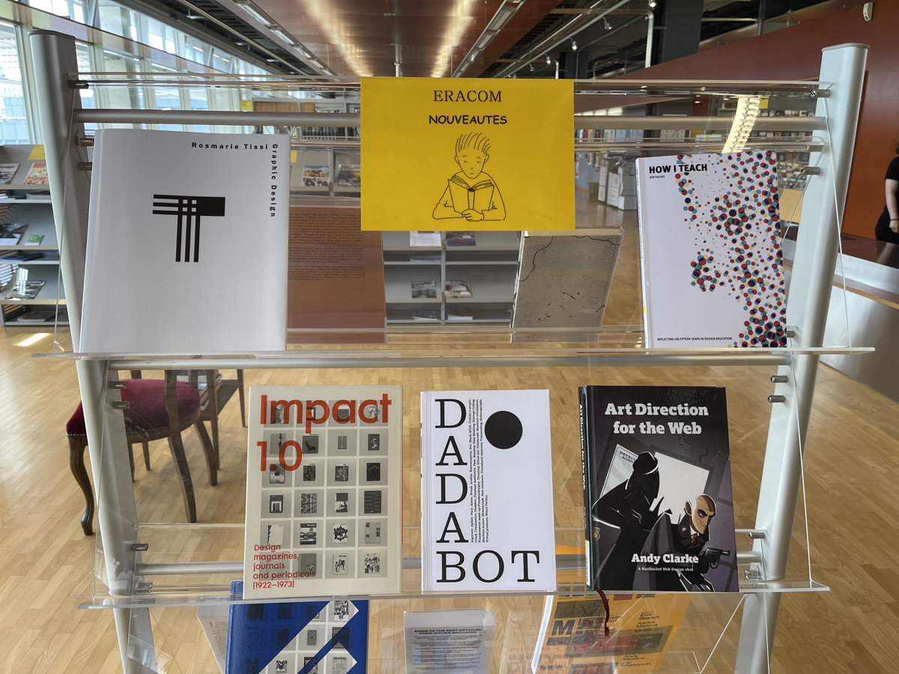

Ce micro-site présente des livres utiles pour l'enseignement en filière IMD. Tous les livres sont disponibles à la [médiathèque Eracom-Epsic](https://www.epsic.ch/index.php/services/mediatheque).

L'objectif est de mettre cette bibliothèque de travail à contribution pour soutenir l'enseignement et l'apprentissage.

## Livres par disciplines

* [Livres Design d'interfaces](design-interfaces.html)
* [Livres Programmation](programmation.html)
* [Livres Audio-vidéo](audio-video.html)
* [Livres Culture visuelle](culture-visuelle.html)
* [Livres Créativité](creativite.html)
* [Livres Marketing](marketing.html)
* [Livres Pédagogie](pedagogie.html)

## Livres par arrivage

* [Nouveautés: septembre 2021](new-2020-10.html).
* [Nouveautés: printemps 2021](new-2021-01.html).
* [Nouveautés: automne 2020](new-2021-02.html).

## Catalogue Renouvaud

Renouvaud est l’interface de recherche du réseau des bibliothèques vaudoises. Ce site vous permet de vérifier si les livres sont disponibles, faire des prolongations, etc:

- [https://renouvaud1.primo.exlibrisgroup.com/](https://renouvaud1.primo.exlibrisgroup.com/)

## Lien Teams

[Ce lien OneDrive](https://eduvaud-my.sharepoint.com/:f:/g/personal/pr51kln_eduvaud_ch/ErS8-cgW6-dJtbrVij7rC_gBCCjlpHsKg0v__pHsS9N3AQ?e=7ucTn8) permet aux enseignant·es d'accéder à des copies numériques de certains de ces livres.

## Autres ressources pédagogiques:

- [Ressources pédagogie](https://code.eracom-pedagogique.ch/pedagogie/)
- [Design Briefs](https://designbriefs.ch/) - site rassemblant des briefs de design.