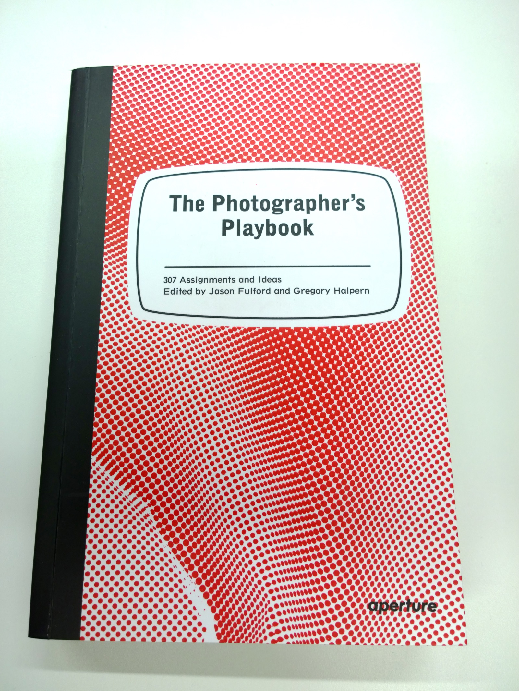
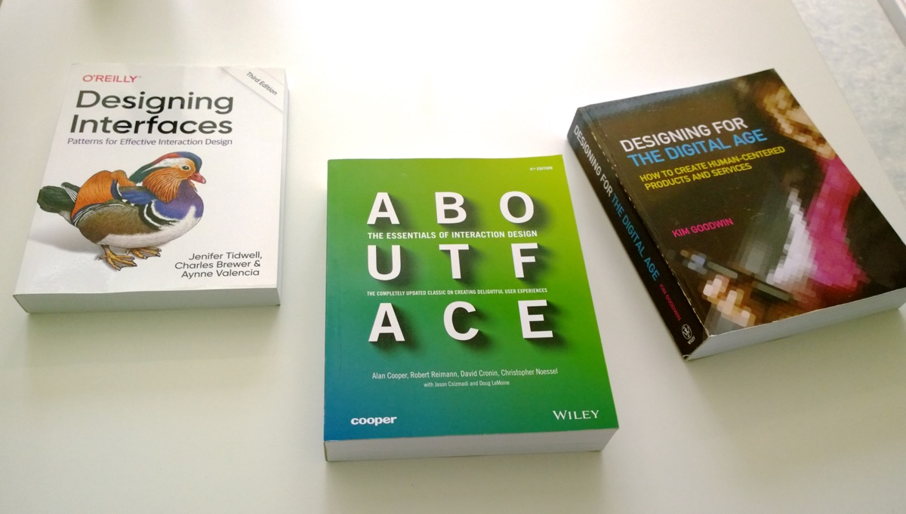
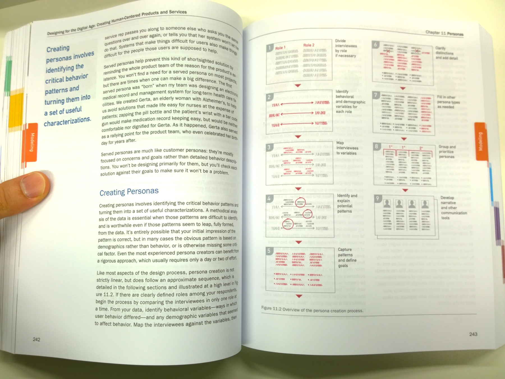
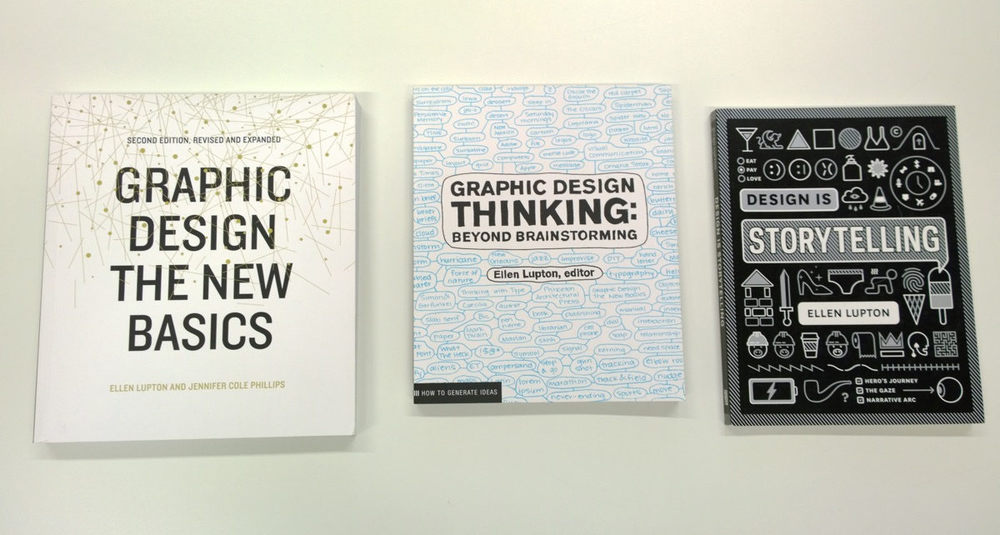
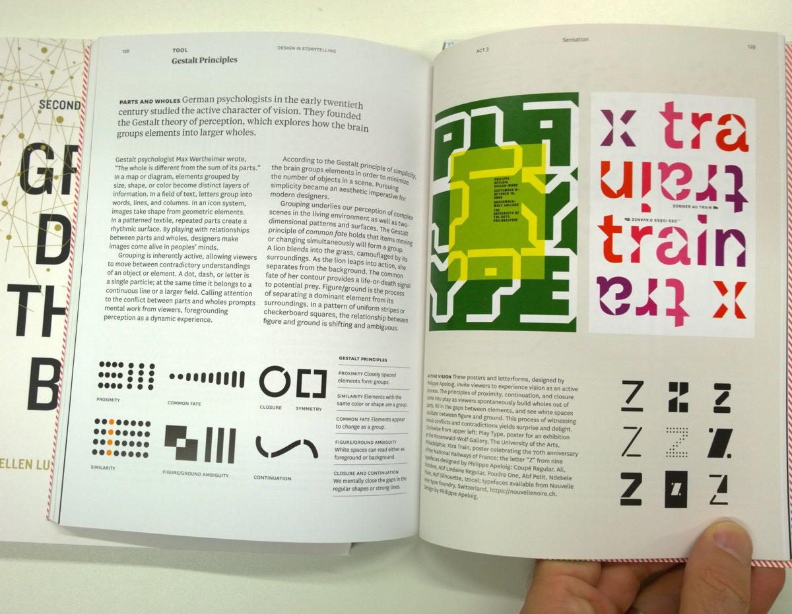
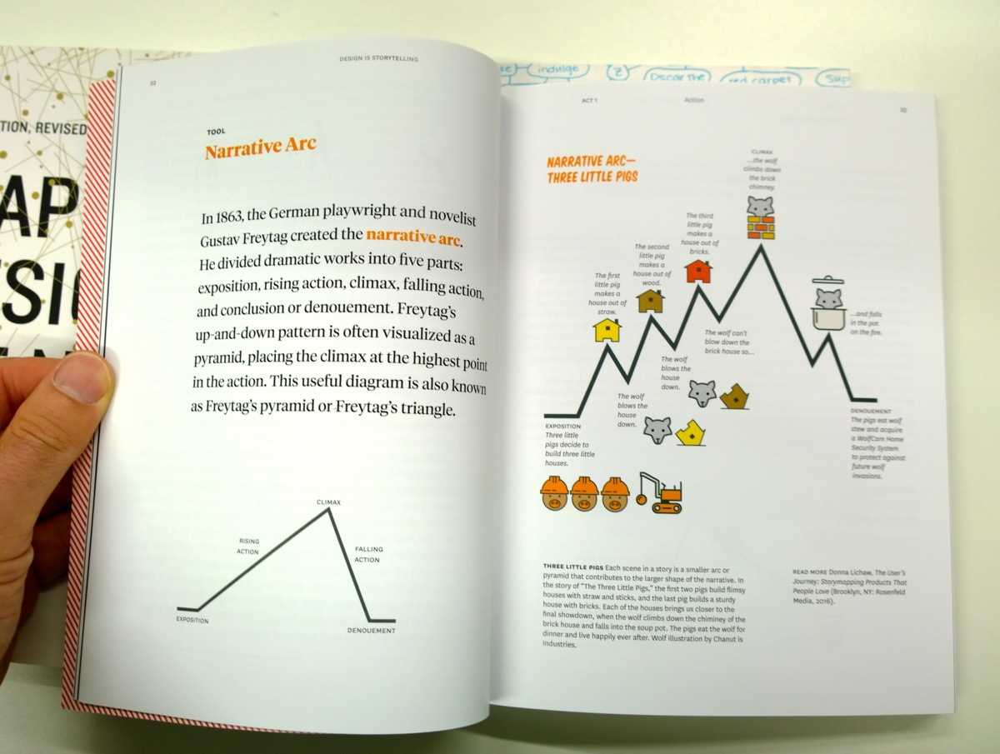

# ---
# layout: page
# title: News 2020
# ---

Livres reçus en octobre 2020.

## The Photographer's Playbook

*The Photographer's Playbook* est un livre-ressource qui propose 307 briefs et idées pour l'enseignement de la photo.

## Design interactif

Trois grands classiques:

- Kim Goodwin (2009). *Designing for the Digital Age*.
- Alan Cooper (2014). *About Face: The Essentials of Interaction Design*.
- Jenifer Tidwell (2020). *Designing Interfaces: Patterns for Effective Interaction Design*.

Ces pavés sont des ouvrages de référence dans le domaine du design d'interaction. Extraits:

## Livres édités par Ellen Lupton

Trois petits bijoux pour l'enseignement du design!

- *Graphic Design: The New Basics*, Princeton Architectural Press
- *Graphic Design Thinking*, Princeton Architectural Press
- *Design is Storytelling*, Thames & Hudson

Extraits:

