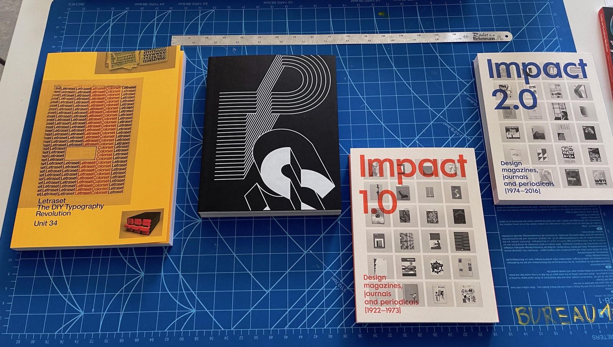

Première commande de livres de 2021, arrivés entre avril-juin.

## Livres de photographie

- *Langford's Advanced Photography*, Michael Langford, Routledge
- *Flora Neocomensis*, Olga Cafiero, Scheidegger & Spiess - travail photo de notre enseignante Olga Cafiero.

### Livres de United Editions

Une maison d'édition anglaise, fondée en 2009: "[Unit Editions](https://www.uniteditions.com/) is an independent publishing venture, producing books for an international audience of designers, design students and followers of visual culture."

- *Manuals 2: Design & Identity Guidelines*	Adrian Shaughnessy, Tony Brook. Edition fac-similé d'indentités graphiques célèbres.
- *What is Universal Everything?*, Adrian Shaughnessy, Tony Brook. Impressionnante monographie sur une agence de design interfactif.
- *Letraset: The DIY Typography Revolution*	Adrian Shaughnessy, Tony Brook	United Editions
- *Paula Scher: Works (concise edition)*, Tony Brook & Adrian Shaughnessy. Monographie de la graphiste Paula Scher.
- *Impact 1.0 & 2.0*, Tony Brook & Adrian Shaughnessy. Collection de couvertures de revues de design graphique.

### Livres de pédagogie

Une série de quatre livres de John Hattie, chercheur australien qui a fait des études statistiques sur l'efficacité de différentes méthodes pédagogies.

- *L'apprentissage visible : ce que la science sait sur l'apprentissage*, John Hattie, éditions l'Instant Présent.
- *L'apprentissage visible pour les enseignants*, John Hattie, Presses de l'Université du Québec.
- *Visible Learning into Action: International Case Studies of Impact*, John Hattie, Routledge.
- *Visible Learning: Feedback*,	John Hattie, Routledge.

### Design d'interfaces et programmation,

- *Web Design. The Evolution of the Digital World 1990–Today*, Rob Ford, Julius Wiedemann, Taschen.
- *Code as Creative Medium*, Golan Levin, MIT Press.
- *Tout JavaScript*, Olivier Hondermarck, Dunod.

### Théorie des médias

- *Dr. Smartphone*, Nicolas Nova & Anaïs Bloch, IDPURE.
- *The Power of Pure Idea*, Thierry Hausermann, IDPURE.
- *Dadabot*, Nicolas Nova, IDPURE.
- *Post-Digital Print : La mutation de l'édition depuis 1894*	Alessandro Ludovico, Editions B42.
- *L'Âge des low tech. Vers une civilisation techniquement soutenable*, Philippe Bihouix, Le Seuil.