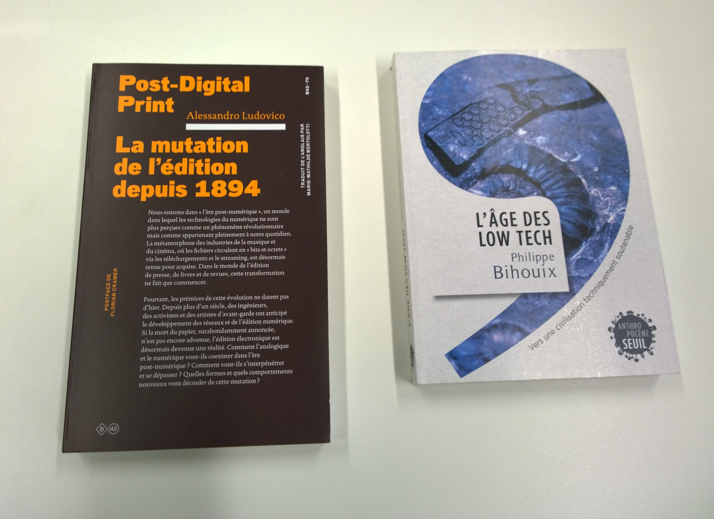

Première commande de livres de 2021, arrivés entre avril-juin.

## Livres de photographie

- *Langford's Advanced Photography*, Michael Langford, Routledge
- *Flora Neocomensis*, Olga Cafiero, Scheidegger & Spiess - travail photo de notre enseignante Olga Cafiero.

### Livres de Unit Editions

Une maison d'édition anglaise, fondée en 2009: "[Unit Editions](https://www.uniteditions.com/) is an independent publishing venture, producing books for an international audience of designers, design students and followers of visual culture."

- *Manuals 2: Design & Identity Guidelines*	Adrian Shaughnessy, Tony Brook. Edition fac-similé d'identités graphiques célèbres.
- *What is Universal Everything?*, Adrian Shaughnessy, Tony Brook. Belle monographie sur [Universal Everything](https://www.universaleverything.com/projects/what-is-universal-everything), une agence de design interactif.
- *Letraset: The DIY Typography Revolution*	Adrian Shaughnessy, Tony Brook	Unit Editions
- *Paula Scher: Works (concise edition)*, Tony Brook & Adrian Shaughnessy. Monographie de la graphiste Paula Scher.
- *Impact 1.0 & 2.0*, Tony Brook & Adrian Shaughnessy. Collection de couvertures de revues de design graphique.

### Livres de pédagogie

Une série de quatre livres de John Hattie, chercheur australien qui utilise une approche scientifique pour déterminer l'efficacité de différentes méthodes pédagogiques.

- John Hattie, *L'apprentissage visible : ce que la science sait sur l'apprentissage*, éditions l'Instant Présent.
- John Hattie, *L'apprentissage visible pour les enseignants*, Presses de l'Université du Québec.
- John Hattie, Deb Masters, Kate Birch (2016). *Visible Learning into Action: International Case Studies of Impact*. Routledge.
- John Hattie and Shirley Clarke (2019). *Visible Learning: Feedback*.	Routledge.

### Design d'interfaces et programmation,

- *Web Design. The Evolution of the Digital World 1990–Today*, Rob Ford, Julius Wiedemann, Taschen.
- Golan Levin and Tega Brain (2021). *Code as Creative Medium*. MIT Press.
- *Tout JavaScript*, Olivier Hondermarck, Dunod.

### Théorie des médias

- *Dr. Smartphone*, Nicolas Nova & Anaïs Bloch, IDPURE. (621.395 NOV)
- *The Power of Pure Idea*, Thierry Hausermann, IDPURE. (765 POW)
- *Dadabot*, Nicolas Nova, IDPURE. (765 NOV)
- *Post-Digital Print : La mutation de l'édition depuis 1894*, Alessandro Ludovico, Editions B42. (655 LUD)
- *L'Âge des low tech. Vers une civilisation techniquement soutenable*, Philippe Bihouix, Le Seuil. (504 BIH)

