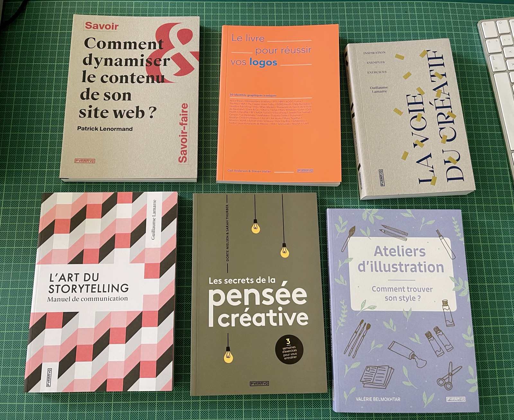
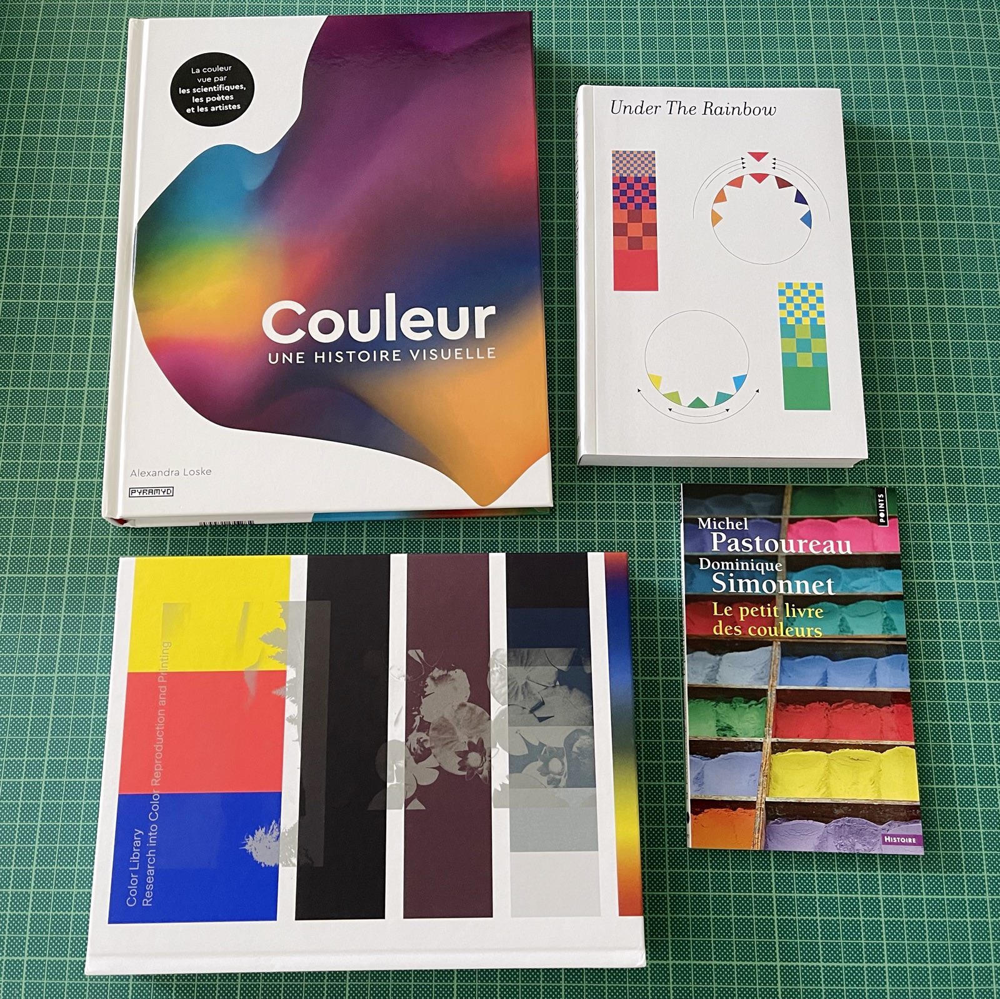
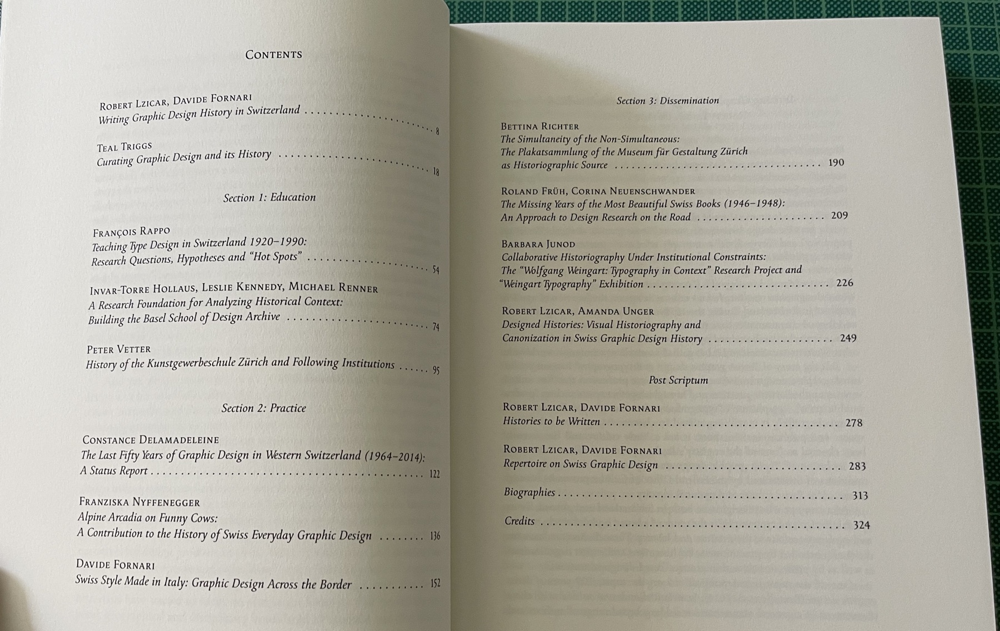

Deuxième commande de livres de 2021, arrivée en début septembre.

### Thématique: créativité

- *La Voie du créatif*, Guillaume Lamarre, Pyramyd.
- *Le livre pour réussir vos logos*, Gail Anderson et Steven Heller
- *L'art du storytelling*, Guillaume Lamarre, Pyramyd.
- *Les secrets de la pensée créative*, Dorte Nielsen, Sarah Thurber, Pyramyd.
- *Ateliers d'illustration*, Valérie Belmokhtar

### Thématique: marketing

- *On se fait un brief?*, Aymeric Bourdin, Pyramyd.
- *Le grand livre du marketing digital*, Claire Gallic & Rémy Marrone, Dunod
- *Comment dynamiser le contenu de son site web*, Patrick Lenormand, Pyramyd.
- *Le livre qu'il vous faut pour réussir sur Youtube*, Will Eagle, Pyramyd.

### Thématique: couleur

- *Couleur : une histoire visuelle*, Alexandra Loske, Pyramyd.
- *Under the Rainbow*, Édité par: Tatiana Rihs, Maximage, ECAL.
- *Color Library - Research into Color Reproduction and Printing*, Maximage & ECAL, JRP|Ringier.
- *Le petit livre des couleurs*, Michel Pastoureau et Dominique Simonnet, Points.

### Histoire du design, de l'enseignement

- *Bobst Graphic, 1972–1981* (version française), Édité par: Giliane Cachin, Triest Verlag / ECAL.
- *Mapping Graphic Design History in Switzerland*, Robert Lzicar, Davide Fornari, Triest Verlag.
- *No Style*, Peter Vetter, Katharina Leuenberger, Meike Eckstein, Triest Verlag.
- *Hermann Eidenbenz, Teaching Graphic Design*, Sarah Klein (ed.), Triest Verlag / ECAL.
- *Technology and Research in Art and Design*, Édité par: Davide Fornari, ECAL.

### Divers

- *Link in Bio – Art After Social Media*, Kehrer Verlag.