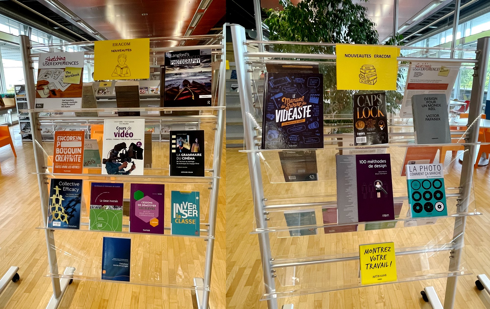
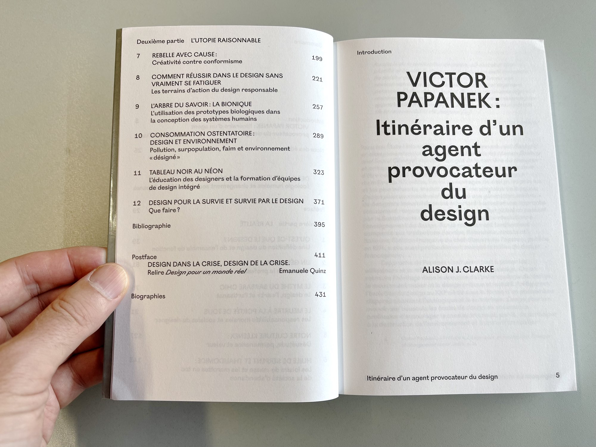
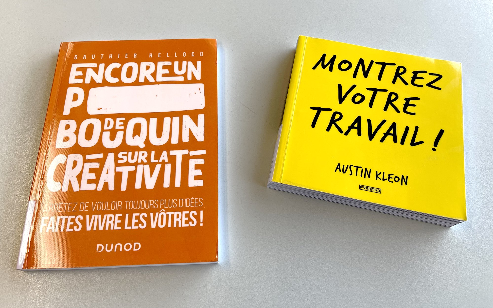
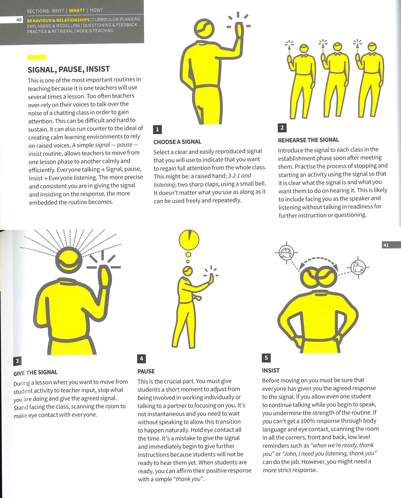

Première commande de livres de 2022, arrivée en août.

### Thématique: Vidéo

- *Le manuel de survie du vidéaste*, Ludoc, Marabout (791 LUD)
- *Cours de vidéo (4e édition)*, Gérard Galès, René Bouillot et Gérard Laurent, Dunod (791 BOU)
- *La grammaire du cinéma : de l'écriture au montage : les techniques du langage filmé*, Yannick Vallet, Armand Colin (791 VAL)

### Thématique: Photo

- *La photo comment ça marche*, David Taylor, Eyrolles (77 TAY)
- *Langford's advanced photography*, Michael Langford, Routledge (77 LAN)

### Thématique: Design

- *Design pour un monde réel*, Victor Papanek, Les Presses du Réel (765 PAP)
- *100 méthodes de design*, Bella Martin & Bruce Hanington, Eyrolles (765 MAR)
- *Encore un p\*\*\*\*\* de bouquin sur la créativité*, Gauthier Helloco, Dunod (159.9 HEL)
- *Montrez votre travail*, Austin Kleon, Pyramyd (159.9 KLE)
- *Caps lock : how capitalism took hold of graphic design, and how to escape from it*, Ruben Pater, Valiz (760 PAT)
- *Teaching Design: A Guide to Curriculum and Pedagogy*, Meredith Davis, Allworth (377 DAV)
- *Sketching User Experiences: The Workbook*, Saul Greenberg et al., Morgan Kaufmann Publishers (765 SKE)

### Thématique: Pédagogie

Les livres de pédagogie sont tous rangés à la cote 371.

Les nouveautés:

- *Inverser la classe*, Bruno Devauchelle, ESF Editeur
- *La classe inversée*, Eid, Cynthia; Oddou, Marc; Liria, Philippe, Clé International
- *Cessons de démotiver les élèves*, Daniel Favre, Dunod (371 FAV)
- *Évaluations, sources de synergies*, Nathalie Younès, Christophe Gremion, Emmanuel Sylvestre (Eds.), ADMEE Europe
- *Comprendre, apprendre, mémoriser : Les neurosciences au service de la pédagogie*, Joseph Stordeur, De Boeck Education
- *Collective Efficacy: How Educators' Beliefs Impact Student Learning*, Jenni Donohoo, Corwin Press (371 DON)
- *The Craft of Assessment*, Michael Chiles, John Catt Educational
- *Teaching Walkthrus: Five-Step Guides to Instructional Coaching*, Tom Sherrington, John Catt Educational

Un extrait de Teaching Walkthrus:

