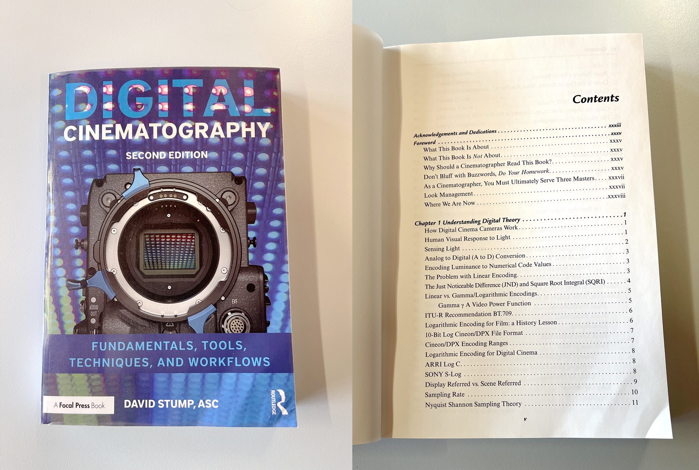
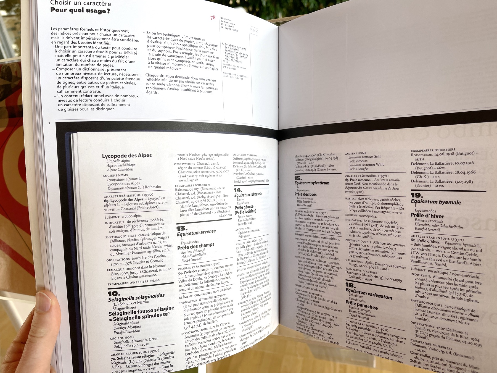

Nouveaux livres arrivés durant le printemps 2023:

## Vidéo

*Digital Cinematography: Fundamentals, Tools, Techniques, and Workflows*  
Par David Stump  
Cote: 791 STU
 
> "David Stump’s Digital Cinematography focuses on the tools and technology of the trade, looking at how digital cameras work, the ramifications of choosing one camera versus another, and how those choices help creative cinematographers to tell a story."

## Design

Une trilogie de livres par Damien Gautier et Florence Roller, Deux-Cent-Cinq Editions (cote: 760 GAU):

1. *Faire une affiche*
2. *Concevoir une identité visuelle*
3. *Observer, comprendre et utiliser la typographie*

Extraits:

## Web

*Touch Design for Mobile Interfaces*  
par Steven Hoober, Smashing Books  
Cote: 004.03.03 HOO